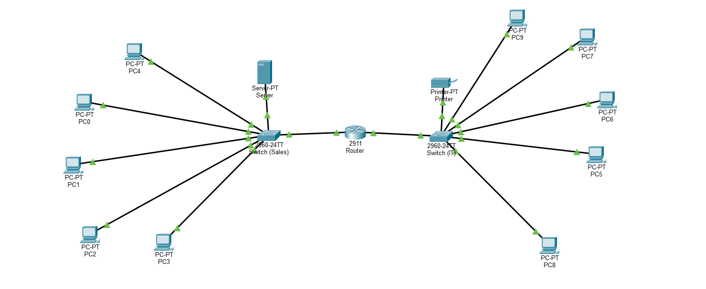

# 🖧 Small Office Network Design (Cisco Packet Tracer)

## 📌 Project Overview
This project demonstrates the design and implementation of a small office network using Cisco Packet Tracer. The network supports multiple departments and enables communication between different subnets using a router.

---

## 🏗️ Network Topology
The network consists of:

- 1 Router
- 2 Switches
- 10 PCs
- 1 Server
- 1 Printer

Topology structure:

---

## 🌐 IP Addressing Scheme

| Department | Network Address | Subnet Mask | Default Gateway |
|------------|---------------|------------|----------------|
| Sales      | 192.168.10.0  | 255.255.255.0 | 192.168.10.1 |
| IT         | 192.168.20.0  | 255.255.255.0 | 192.168.20.1 |

---

## ⚙️ Configuration Details

### Router Configuration
- Configured using CLI
- Assigned IP addresses to interfaces:
  - G0/0 → 192.168.10.1
  - G0/1 → 192.168.20.1
- Enabled interfaces using `no shutdown`

### End Devices
- Assigned static IP addresses
- Configured default gateway for inter-network communication

### Printer Configuration
- Assigned static IP: `192.168.20.50`
- Accessible from all devices across networks

---

## 🔌 Connectivity

- Router ↔ Switch: Straight-through cable  
- Switch ↔ PC: Straight-through cable  
- Console cable used for router configuration  

---

## 🔄 Network Functionality

- Devices within the same network communicate via switches
- Devices in different networks communicate through the router
- Router performs routing based on IP addresses

---

## 🧪 Testing & Verification

- Used `ping` command to test connectivity
- Verified:
  - PC to PC communication
  - PC to Router communication
  - Cross-network communication
  - Printer accessibility

---

## 🧠 Key Concepts Learned

- Network topology design
- IP addressing and subnetting
- Default gateway concept
- Router and switch roles
- Basic CLI configuration
- Packet flow between networks
- Network troubleshooting

---

## ⚠️ Challenges Faced

- Interfaces initially shutdown
- Incorrect IP and gateway configuration
- Connectivity issues resolved using troubleshooting techniques

## 📸 Screenshot

*

---

## 📁 Files Included

- `small-office-network.pkt`

---

## 📚 Conclusion

This project helped build a strong foundation in networking concepts and provided hands-on experience in configuring and troubleshooting a basic network environment.
